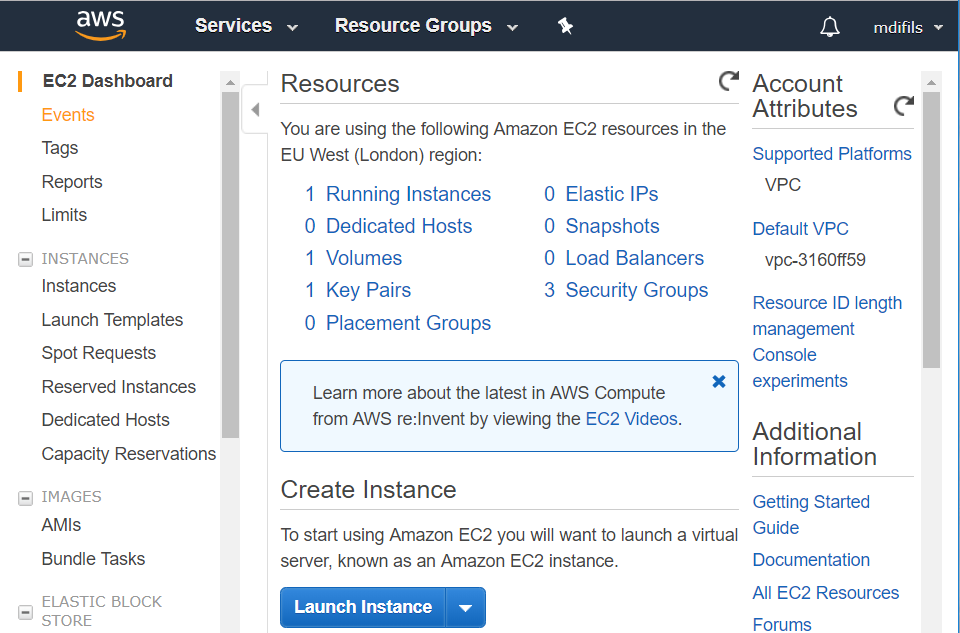

# Linux Server Configuration
In this project, I'm going to show you how to prepare a baseline linux server in
order to host a flask application. I'll use Amazon Web Service to create a
remote virtual machine (Ubuntu 18.04 server). Then I'll secure, configure it and
deploy my Item Catalogue application: [Movie Actors App](https://github.com/mdifils/CatalogApp).
Here is a summary of information about my server for the reviewer:

* **The IP address and SSH port**,  IP: **35.177.223.249** and Port: **2200**
* **The complete URL to my hosted web application**: [https://movie.actors.mdifils.com](https://movie.actors.mdifils.com)
* **App directory(WSGIScript File in/web root path)**: /var/www/flaskApp/catalogApp/
* **'grader' SSH private key**: provided durint submission.
* **'grader' SSH passphrase**: `ubuntuserverconfig`.
* **'grader' user password**: `grader`
* **A list of some third-party resources I used to complete this project**: <br>
<ins>Amazon Web Service</ins>: To create a remote ubuntu server and to host my web application. <br>
<ins>GoDaddy</ins>: To purchase and register the domain name of my web application. <br>
<ins>Letsencrypt</ins>: To secure my web application with a free signed SSL certificate.<br>
<ins>Digital Ocean</ins>: for some guidelines. <br>
* **A summary of software I installed**: <br>
<ins>Finger</ins>: <br>
<ins>New user added</ins>: <br>
<ins>Public ssh key</ins>: <br>
<ins>UTC time</ins>: <br>
<ins>Apache2</ins>: <br>
<ins>Libapache2-mod-wsgi-py3</ins>: <br>
<ins>/home/new-user/.local/bin added to $PATH</ins>: <br>
<ins>pip</ins>: <br>
<ins>Virtualenv</ins>: <br>
<ins>Flask</ins>: <br>
<ins>Flask-Login</ins>: <br>
<ins>Flask-SQLAlchemy</ins>: <br>
<ins>Flask-Migrate</ins>: <br>
<ins>Oauth2client</ins>: <br>
<ins>requests</ins>: <br>
<ins>PostgreSQL</ins>: <br>
<ins>Pscycopg2</ins>: <br>
<ins>certbot</ins>: <br>
* **SSH key location**: <br>
<ins>Public key</ins>: /home/grader/.ssh/authorized_keys. <br>
<ins>Private key</ins>: Put the content provided during the submission in either
suggested folder <br>
_Windows_: /c/Users/owner/.ssh/privatekey.pem <br>
_MAC_: /Users/owner/.ssh/privatekey.pem <br>
_Linux_: /home/owner/.ssh/privatekey.pem <br>

### Remote Virtual Machine Creation
There are many ways to do that, you can create lightsail or EC2 instances with [Amazon Web Service](https://aws.amazon.com/console/). But you can also create droplet instances with [Digital Ocean](https://www.digitalocean.com/). In this project, I'll launch a Linux Virtual Machine with Amazon EC2.
* In the AWS Management console, choose first your region in the up right corner (mine is London). Then click on EC2 under "Compute" section: All services->Compute->EC2.

* Launch EC2 instance and choose an Amazon Machine Image


* Choose an Instance Type (_Free tier eligible means that you can use free of charge for the first year_) and go to next step (Instance configuration: leave default)


* Add storage and go to next step (Add tag: give a name to your server)


* Configure the security group (create a new one, give it a name, a description allow incoming ports: 22, 2200, 80, 123)

* Check that everything is okay and Launch

* Create a new key pair and download it in order to log into your instance via ssh.


### Ubuntu Server Configuration
* Connect to your instance using the key you've just downloaded and your instance public IP (look at the last picture) <br>
`$ ssh -i /path/to/privatekey.pem ubuntu@Public_IP`

* After updating all current packages, install Finger package and add a new user grader (User: grader, password: grader, Full name: Udacity Grader) <br>
`$ sudo apt install finger` <br>
`$ sudo adduser grader` <br>
`$ finger grader`
* Give grader sudo access <br>
`$ sudo nano /etc/sudoers.d/grader` write and save this file.

Adding 'grader' user in sudo group. <br>

* Create a new key pair <br>
On LOCAL computer generate key pair using ssh-keygen <br>

On server side, use (**su grader** followed by password: grader). Switch to grader user to load in public key file. Make sure you are in grader home directory (/home/grader) by checking with this command: `$ pwd` <br>
`$ sudo touch .ssh/authorized_keys` <br>
The ~/.ssh/authorized_keys file contains public keys for authentication.
Each line of the file contains one SSH public key specification (empty lines and lines starting with # are ignored as comments). It should not be opened to anyone, so let's set up permission accordingly.<br>
```
$ sudo chmod 700 .ssh
$ sudo chmod 644 .ssh/authorized_keys
$ ls -al .ssh
total 12
drwx------ 2 grader grader 4096 Jan 26 23:19 .
drwxr-xr-x 7 grader grader 4096 Jan 26 12:09 ..
-rw-r--r-- 1 grader grader  403 Jan 17 04:38 authorized_keys
```
Copy public key in the local machine <br>
`$ cat /c/Users/miche/.ssh/ubuntuserverconfig.pem.pub` <br>
Then paste it into the server. <br>
`$ nano .ssh/authorized_keys `
* Change SSH Port to 2200 and disable root Login<br>
`$ sudo nano /etc/ssh/sshd_config` modify and save

`$ sudo service ssh restart` to restart ssh.
* UFW firewall configuration


You can now use this new key pair and this new port to connect to server.


* Change Time Zone to UTC (**sudo dpkg-reconfigure tzdata**). Scroll down to none of them  then select UTC.
* install Apache2 `$ sudo apt-get install apache2` and test it

Apache can do much more than just returning a file, we need to install the package below to allow Apache handling our flask application.<br>
`$ sudo apt-get install libapache2-mod-wsgi-py3` <br>
`$ sudo service apache2 restart` to restart apache2
* Installing pip: <br>
It is advised to never use pip with sudo. Instead you should always install into your user directory (via pip install --user) or within virtualenvs
```
$sudo nano ~/.profile
# add these two lines at the end of `~/.profile` file:
export PY_USER_BIN=$(python3 -c 'import site; print(site.USER_BASE + "/bin")')
export PATH=$PY_USER_BIN:$PATH
$ source ~/.profile
$ echo $PATH
/home/grader/.local/bin:/home/grader/.local/bin:/usr/local/sbin:/usr/local/bin:/usr/sbin:/usr/bin:/sbin:/bin:/usr/games:/usr/local/games:/snap/bin
$ sudo apt-get install -y python3-dev
$ curl -LO https://bootstrap.pypa.io/get-pip.py
$ python3 get-pip.py --user
$ pip -V
pip 19.0.1 from /home/grader/.local/lib/python3.6/site-packages/pip (python 3.6)
# Installing virtualenv
$ pip install virtualenv --user
```
* **Deploying flask application**
```
$ sudo mkdir -p /var/www/flaskApp/catalogApp
# Giving ownership
$ sudo chown $USER:$USER -R /var/www/flaskApp
$ cd /var/www/flaskApp/catalogApp
$ virtualenv venv
$ source venv/bin/activate
# Installing flask application requirements in the virtualenv
$ pip install flask flask-login flask-sqlalchemy flask-migrate
$ pip install requests oauth2client
$ pip freeze
$ deactivate
$ git clone https://github.com/mdifils/CatalogApp.git
# Visit my github repo to better understand my flask application
$ sudo nano /etc/apache2/sites-available/catalogapp.conf
```


```
# Disabling the default virtualHost and enabling the new one.
$ sudo a2dissite 000-default.conf
$ sudo a2ensite catalogapp.conf
$ sudo systemctl restart apache2
$ nano /var/www/flaskApp/catalogApp/catalogapp.wsgi
$ sudo service apache2 restart
```


**Installing and configuring PostgreSQL**
```
$ sudo apt-get install -y postgresql postgresql-contrib

Success. You can now start the database server using:

    /usr/lib/postgresql/10/bin/pg_ctl -D /var/lib/postgresql/10/main -l logfile start

Ver Cluster Port Status Owner    Data directory              Log file
10  main    5432 down   postgres /var/lib/postgresql/10/main /var/log/postgresql/postgresql-10-main.log
```
By default PostgreSQL doesn't allow remote connections, let's double check it.


We have either local or 127.0.0.1/32 (IPv4) and ::/128 (IPv6) which are both interfaces that specify the local machine. That means no remote connections are allowed.<br>
**Creating New database user**: with _name_: catalog and _password_: catalog, _database_: movieactors

By default, Postgres creates a Linux superuser  called "postgres" which can be used to access the system.
```
grader@ip-172-31-22-109:~$ sudo su - postgres
postgres@ip-172-31-22-109:~$ psql
psql (10.6 (Ubuntu 10.6-0ubuntu0.18.04.1))
Type "help" for help.

postgres=# CREATE ROLE catalog WITH createdb;
CREATE ROLE
postgres=# ALTER ROLE catalog WITH login;
ALTER ROLE
postgres=# ALTER ROLE catalog WITH PASSWORD 'catalog';
ALTER ROLE
postgres=# CREATE DATABASE movieactors WITH OWNER catalog;
CREATE DATABASE
postgres=# \q
postgres@ip-172-31-22-109:~$ exit
logout
grader@ip-172-31-22-109:~$
```
Let's connect the database with our flask application. First of all we need to edit our flask application to use PostgreSQL as database engine instead of SQLite.


Be aware that our flask application is written in python. Unlike SQLite which comes built in python, PostgreSQL needs a DB-API to communicate with python. That is why we are going to install Pscycopg2, likely for us we won't use it directly in our program. Flask-SQLAlchemy will take of that for us  by converting classes in our models.py file into tables within our database movieactors. Flask-Migrate will take of migrations and commit changes into into the database.
```
(venv) grader@ip-172-31-22-109:/var/www/flaskApp/catalogApp$ pip install psycopg2-binary
(venv) grader@ip-172-31-22-109:/var/www/flaskApp/catalogApp$ flask db init
(venv) grader@ip-172-31-22-109:/var/www/flaskApp/catalogApp$ flask db migrate -m "first migration"
INFO  [alembic.runtime.migration] Context impl PostgresqlImpl.
INFO  [alembic.runtime.migration] Will assume transactional DDL.
INFO  [alembic.autogenerate.compare] Detected added table 'users'
INFO  [alembic.autogenerate.compare] Detected added index 'ix_users_email' on '['email']'
INFO  [alembic.autogenerate.compare] Detected added index 'ix_users_username' on '['username']'
INFO  [alembic.autogenerate.compare] Detected added table 'actors'
INFO  [alembic.autogenerate.compare] Detected added index 'ix_actors_name' on '['name']'
INFO  [alembic.autogenerate.compare] Detected added table 'blogPosts'
INFO  [alembic.autogenerate.compare] Detected added table 'movies'
  Generating
  /var/www/flaskApp/catalogApp/migrations/versions/680ad94cd943_first_migration.py
  ... done
(venv) grader@ip-172-31-22-109:/var/www/flaskApp/catalogApp$ flask db upgrade
INFO  [alembic.runtime.migration] Context impl PostgresqlImpl.
INFO  [alembic.runtime.migration] Will assume transactional DDL.
INFO  [alembic.runtime.migration] Running upgrade  -> 680ad94cd943, first migration
```
We have connected the database with our flask application, let's check it:


```
# Setting up SSL
$ sudo add-apt-repository ppa:certbot/certbot
$ sudo apt install python3-certbot-apache
# Allowing HTTPS through the Firewall
$ sudo ufw allow 443/tcp
# blocking port 22
$ sudo ufw delete allow ssh
$ sudo ufw status
Status: active

To                         Action      From
--                         ------      ----
2200/tcp                   ALLOW       Anywhere
80/tcp                     ALLOW       Anywhere
123/udp                    ALLOW       Anywhere
443/tcp                    ALLOW       Anywhere
2200/tcp (v6)              ALLOW       Anywhere (v6)
80/tcp (v6)                ALLOW       Anywhere (v6)
123/udp (v6)               ALLOW       Anywhere (v6)
443/tcp (v6)               ALLOW       Anywhere (v6)

# Obtaining an SSL Certificate
# Make sure to comment first in the virtualHost the following line:
# WSGIDaemonProcess catalogapp user=grader group=grader threads=5

$ sudo certbot --apache -d mdifils.com -d movie.actors.mdifils.com
```

If this is your first time running certbot, you will be prompted to enter an email address and agree to the terms of service. After doing so, certbot will communicate with the Let's Encrypt server, then run a challenge to verify that you control the domain you're requesting a certificate for.
If that's successful, certbot will ask how you'd like to configure your HTTPS settings:


You can uncomment the same line: "WSGIDaemonProcess catalogapp user=grader group=grader threads=5" in the virtualHost and notice the three last lines added by certbot.

Notice the new virtualHost created by certbot : `catalogapp-le-ssl.conf` in order to redirect HTTP to HTTPS <br>


Use links provided in certbot report to test your configuration.

Now Test your application in the Browser.

